# ⚠️ DEX DEPLOYMENT STATUS

## Current State

```text
❌ DEX Factory:    NOT DEPLOYED (placeholder: 0x...)
❌ DEX Router:     NOT DEPLOYED (placeholder: 0x...)
✅ RPC Status:     VERIFIED (https://evmrpc.0g.ai)
```

## What Needs to Happen

Your DEX deployment is **ready to execute** but has not been deployed yet. Here's what's needed:

### 1. **Fix RPC Issues (Optional but Recommended)**

The RPC endpoints may be under maintenance. Before deployment, test connectivity:

```bash
# Test primary RPC
curl -s -X POST https://rpc.0g.ai \
  -H "Content-Type: application/json" \
  --data '{"jsonrpc":"2.0","method":"eth_chainId","params":[],"id":1}'

# Test backup RPC
curl -s -X POST https://rpc-backup.0g.ai \
  -H "Content-Type: application/json" \
  --data '{"jsonrpc":"2.0","method":"eth_chainId","params":[],"id":1}'
```

If both fail, check: <https://docs.0g.ai> for current RPC endpoints.

### 2. **Verify Prerequisites**

```bash
bash QUICKSTART_DEX.sh
```

This will check:

- ✅ `.env.launch` configuration
- ✅ Required environment variables
- ✅ RPC connectivity (with retries)
- ✅ Deployer wallet setup

### 2.5 **Verify Funding**

After sending 5-10 A0G tokens to the deployer wallet:

```bash
# Quick verification (with retry logic & error handling)
npm run verify-funding

# Or detailed check
npm run check-balance
```

Should show:
```text
💰 Current Balance: 7.5000 A0G
✅ SUCCESS: Sufficient balance for DEX deployment!
```

**Features:** Automatic retry on network timeouts, precise decimal handling, 10s timeout protection

### 3. **Choose Your Deployment Method**

#### Option A: Hardhat (Recommended)

```bash
npm install -D hardhat @nomicfoundation/hardhat-ethers
npm install @uniswap/v2-core @uniswap/v2-periphery ethers
cp hardhat.config.template.ts hardhat.config.ts
npx hardhat run scripts/hardhat-deploy-uniswap-v2.ts --network 0g-aristotle
```

#### Option B: MetaMask GUI (See SOVEREIGN_DEX_DEPLOYMENT.md)

#### Option C: TypeScript Direct (See DEX_DEPLOYMENT_EXECUTION.md)

### 4. **Verify Deployment**

After deployment completes:

```bash
bash scripts/verify-dex-deployment.sh
cat .env.launch | grep DEX_
```

Should show:

```text
✅ Factory deployed: 0x<address>
✅ Router deployed: 0x<address>
```

---

## 📋 Checklist Before Deployment

- [x] Run `bash QUICKSTART_DEX.sh` and verify all checks pass
- [x] `.env.launch` has DEPLOYER_PRIVATE_KEY and DEPLOYER_ADDRESS
- [ ] Send 5-10 A0G tokens to deployer wallet: `0x353663cd664bB3e034Dc0f308D8896C0a242e4cd`
- [ ] Run `npm run verify-funding` to confirm sufficient balance
- [x] Choose deployment method (Hardhat recommended)
- [x] For Hardhat: `npm install` completed
- [x] For Hardhat: `cp hardhat.config.template.ts hardhat.config.ts`

---

## 📊 Deployment Statistics

| Item | Status |
| --- | --- |
| Deployment Scripts | ✅ Ready |
| Documentation | ✅ Ready |
| Configuration | ✅ Ready |
| RPC Connectivity | ✅ Verified |
| Deployment Execution | 🔴 Not Started |

---

## 🚀 Next Steps

1. **Right now**: Send 5-10 A0G to `0x353663cd664bB3e034Dc0f308D8896C0a242e4cd`
2. **Then**: Run `npm run verify-funding` to confirm balance
3. **Execute**: Run `npx hardhat run scripts/hardhat-deploy-uniswap-v2.ts --network 0g-aristotle`
4. **Verify**: Check addresses saved to `.env.launch`

Total time to completion: **~15 minutes**

---

## ⏰ Timeline

| Phase | Status | Duration |
| --- | --- | --- |
| Environment Setup | ✅ Done | - |
| Script Creation | ✅ Done | - |
| Documentation | ✅ Done | - |
| RPC Testing | ✅ Done | 2 min |
| Wallet Funding | 🔴 Pending | 5-10 min |
| Balance Verification | 🔴 Pending | 1 min |
| Deployment | 🔴 Pending | 10-15 min |
| Verification | 🔴 Pending | 2 min |

---

## 🤖 CI/CD Automation

**GitHub Actions Workflow**: `.github/workflows/deployment-gate.yml`

### Enterprise-Grade Features:
- **Circuit Breaker Logic**: Multi-RPC fallback with latency-based selection
- **Gas Price Intelligence**: Dynamic fee calculation with market awareness
- **Spike Protection**: Automatic retry logic for transient gas price spikes
- **Production Gates**: Prevents deployment during extreme network conditions

### Automated Checks on Every Push:
- ✅ **Funding Verification**: Gas-aware balance validation with multi-RPC resilience
- ✅ **Gas Intelligence**: Real-time fee analysis with reasonableness checks
- ✅ **RPC Health**: Latency testing and automatic failover selection
- ✅ **Deployment Report**: Comprehensive readiness assessment

### Gas Price Intelligence:
```yaml
# Dynamic Fee Calculation
maxFeePerGas = baseFee × 1.2  # 20% buffer
maxPriorityFeePerGas = 2 gwei  # Conservative priority

# Spike Detection & Retry
MAX_RETRIES: 3
RETRY_DELAY: 60s
THRESHOLD: 50 gwei

# If gas > 50 gwei: Wait 60s and retry
# If still high: Manual review required (no hard fail)
```

### Pipeline Flow:

```mermaid
graph TD
    A[Push to main] --> B[CI/CD Pipeline Starts]
    B --> C[Select Fastest RPC]
    C --> D[Verify Funding Gate]
    D --> E{Gate Status}
    E -->|✅ PASSED| F[Gas Intelligence Check]
    E -->|❌ FAILED| G[Block Deployment]
    F --> H{Gas Reasonable?}
    H -->|✅ Yes| I[RPC Health Check]
    H -->|⚠️ No| J[Retry with Delay]
    J --> H
    I --> K[Generate Report]
    K --> L[Deploy DEX Contracts]
```


### Manual Override:
For testing purposes, you can skip funding verification:
```bash
# Via GitHub Actions dispatch with skip_funding_check=true
```

### Environment Variables Required:
Add to GitHub Secrets:
- `DEPLOYER_ADDRESS`: Your deployer wallet address
- `DEPLOYER_PRIVATE_KEY`: Private key for automated deployment (optional)

- **Full Guide**: See `SOVEREIGN_DEX_DEPLOYMENT.md`
- **Quick Start**: See `DEX_DEPLOYMENT_EXECUTION.md`
- **Inventory**: See `DEX_SUITE_INVENTORY.md`
- **Balance Check**: Run `npm run verify-funding`
- **Status Check**: Run `bash QUICKSTART_DEX.sh`

---

**Status**: 🔄 READY FOR FUNDING (Send 5-10 A0G to deployer wallet)

**CI/CD Status**: 🛡️ **ENTERPRISE-GRADE FLIGHT CONTROLLER ACTIVE**
- Circuit breaker architecture with multi-RPC resilience
- Gas price intelligence with spike detection and retry logic
- Latency-based RPC selection for optimal performance
- Automated balance verification with gas cost awareness
- Production-ready deployment gates with manual override options

Generated: January 6, 2026
