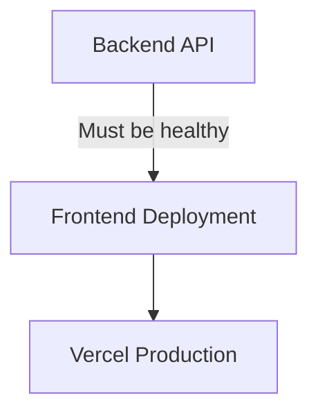

# Deployment Scripts

This directory contains automated deployment scripts for the Quantum Pi Forge ecosystem.

## Scripts Overview

### 📊 health-check.sh
Comprehensive health check for all services in the ecosystem.

**Usage:**
```bash
./scripts/deployment/health-check.sh
```

**Checks:**
- Backend API (Railway): https://pi-forge-quantum-genesis.railway.app
- Public Site (GitHub Pages): https://onenoly1010.github.io/quantum-pi-forge-site
- Frontend Dashboard (Vercel): https://quantumpiforge.com
- Resonance Engine (Vercel): https://quantum-resonance-clean.vercel.app

### 🚀 deploy-frontend.sh
Deploy Frontend Dashboard to Vercel with backend health validation.

**Usage:**
```bash
./scripts/deployment/deploy-frontend.sh
```

**Features:**
- Validates backend health before deployment
- Builds frontend with `npm run build`
- Deploys to Vercel production
- Verifies deployment success

**Requirements:**
- Backend must be healthy (status 200)
- Vercel CLI installed and authenticated
- Node.js and npm installed

### 🔐 deploy-contracts.sh
Deploy smart contracts to specified blockchain network.

**Usage:**
```bash
./scripts/deployment/deploy-contracts.sh [NETWORK]
```

**Networks:**
- `polygon` - Deploy to Polygon Mainnet
- `pi-mainnet` - Deploy to Pi Network Mainnet
- `0g-testnet` - Deploy DEX to 0G Aristotle Testnet (default)

**Example:**
```bash
# Deploy to Polygon
./scripts/deployment/deploy-contracts.sh polygon

# Deploy to 0G Testnet (default)
./scripts/deployment/deploy-contracts.sh
```

**Requirements:**
- `DEPLOYER_PRIVATE_KEY` environment variable must be set
- Hardhat configuration for target network
- Sufficient gas tokens in deployer wallet

### 🌐 master-deploy.sh
Master deployment orchestration script for phase-based deployments.

**Usage:**
```bash
./scripts/deployment/master-deploy.sh [PHASE]
```

**Phases:**
- `phase1` - Already deployed (Backend API, Public Site)
- `phase2` - Deploy Application Layer (Resonance Engine, Frontend Dashboard)
- `phase3` - Deploy Smart Contracts (Pi Network, 0G DEX)
- `all` - Deploy all phases (Phase 2 + Phase 3)

**Examples:**
```bash
# Deploy Phase 2 only
./scripts/deployment/master-deploy.sh phase2

# Deploy Phase 3 only
./scripts/deployment/master-deploy.sh phase3

# Deploy all phases
./scripts/deployment/master-deploy.sh all

# Show Phase 1 status
./scripts/deployment/master-deploy.sh phase1
```

## Deployment Phases

### Phase 1: Infrastructure (Already Deployed)
- ✅ Backend API on Railway
- ✅ Public Site on GitHub Pages

### Phase 2: Application Layer
- 🚀 Resonance Engine (Auto-deployed via Vercel)
- 🚀 Frontend Dashboard (Deployed via deploy-frontend.sh)

### Phase 3: Smart Contracts
- 🔐 OINIO Token (Already deployed on Polygon)
- 🔐 Pi Network Contracts (To be deployed)
- 🔐 0G DEX Contracts (Ready to deploy)

## Environment Variables

### Required for Frontend Deployment
- `VERCEL_TOKEN` - Vercel authentication token (optional if CLI is authenticated)

### Required for Contract Deployment
- `DEPLOYER_PRIVATE_KEY` - Private key for contract deployment wallet
- `POLYGON_RPC_URL` - RPC URL for Polygon network
- `PI_NETWORK_RPC_URL` - RPC URL for Pi Network
- `ZERO_G_RPC_URL` - RPC URL for 0G Network

## Deployment Dependencies

### Frontend Deployment Requirements


**Critical:** Frontend deployment will fail if Backend API health check fails.

## Testing Deployments

1. **Pre-deployment Check:**
```bash
./scripts/deployment/health-check.sh
```

2. **Deploy Application Layer:**
```bash
./scripts/deployment/master-deploy.sh phase2
```

3. **Verify Deployment:**
```bash
./scripts/deployment/health-check.sh
```

## Troubleshooting

### Frontend Deployment Fails
- Verify backend is healthy: `curl https://pi-forge-quantum-genesis.railway.app/api/deployment/health`
- Check Node.js version: `node --version` (should be 18+)
- Verify Vercel CLI: `vercel --version`
- Check build locally: `npm run build`

### Contract Deployment Fails
- Verify `DEPLOYER_PRIVATE_KEY` is set and valid
- Check wallet has sufficient gas tokens
- Verify RPC URL is accessible
- Check Hardhat configuration for network

### Health Check Shows All Offline
- This is normal if running in CI/CD or sandboxed environment
- External services may be temporarily unavailable
- Check individual service URLs directly

## CI/CD Integration

These scripts can be integrated into CI/CD pipelines:

```yaml
# Example GitHub Actions workflow
- name: Health Check
  run: ./scripts/deployment/health-check.sh

- name: Deploy Frontend
  run: ./scripts/deployment/deploy-frontend.sh
  env:
    VERCEL_TOKEN: ${{ secrets.VERCEL_TOKEN }}
```

## Security Notes

⚠️ **Never commit private keys or secrets to the repository**

- Use environment variables for sensitive data
- Store secrets in GitHub Secrets, Vercel Environment Variables, or similar
- Rotate keys regularly
- Use separate wallets for different networks

## Support

For issues or questions about deployment scripts:
- Check the main repository README
- Review GitHub Issues
- Contact the development team

---

**Last Updated:** 2026-02-07
**Version:** 3.3.0
